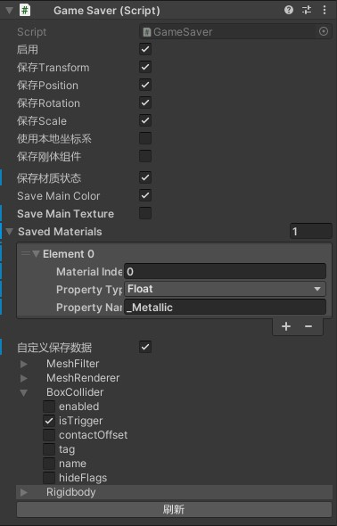

EasyGameSaver：易于使用的通用存档脚本
=================

例如：解密游戏中，您需要保存各个开关的状态，可移动物体的位置，等等。

只需添加GameSaver到您想保存的Game Object，调用GameSaveMgr中的Save和Load方法即可实现！

快速上手：
-------
1. 在场景中新建一个空物体，添加GameSaveMgr组件；
2. 将GameSaver添加到要保存的GameObject上，如果是Prefab，请将该Prefab添加到GameSaveMgr上的Registered Prefabs中；
3. 随时调用GameSaveMgr.SaveGame(存档名称)来保存存档，调用GameSaveMgr.LoadGame(存档名称)来加载存档。

已知问题：
-------
1. 当一个Prefab带有GameSaver时，GameSaveMgr中会自动添加一项，但prefabObject显示为missing，您需要手动指定；
2. 当一个Prefab带有GameSaver时，其子物体不能带有GameSaver；

注意事项：
-------
加载存档时依靠Prefab的hash值查找并恢复，要确保GameSaveMgr中Registered Prefabs的hash值没有重复且在存档后不要更改。  
